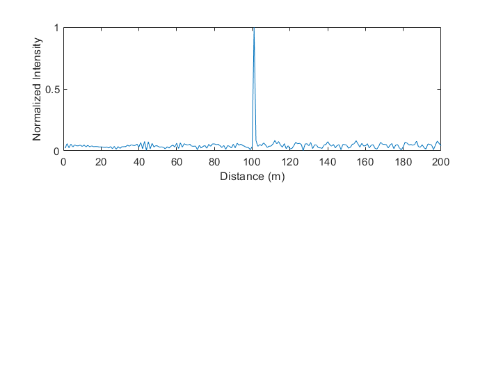
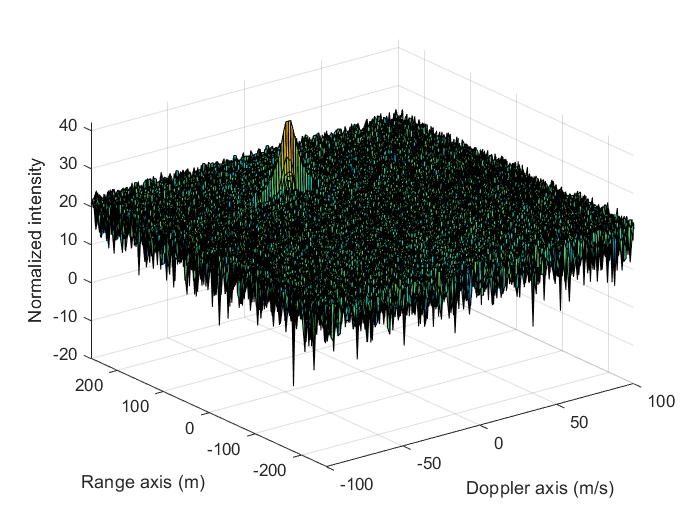
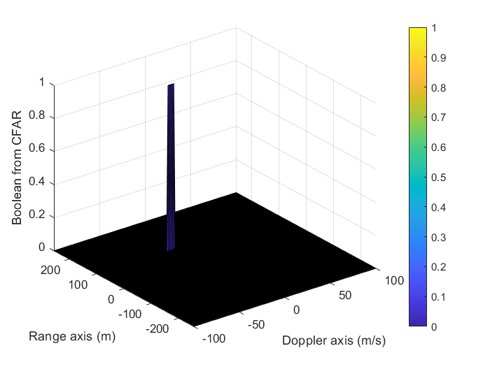

# SFND Radar Project

## Radar and CFAR

Simulates a continuously frequency sweeping radar operating a 77GHz with a sweep time, 200 m range, and 1 m resolution. Creates an object starting at 110 m away and moving relative to the ego car at -20 m/s.

## Question 1
Bandwidth is calculated as c/(2 x resolution) on line 33.

Tchirp is as 5.5 x 2 x range/c on line 36.

Slope is the ratio Bandwidth / Tchirp.

## Question 2

Loop begins on line 65. For every point in time, the position of the car (relative the ego car) is recalculated assuming constant velocity. Radar waveform is modeled as a cos function, frequency determined by position in the sweep. Returned signal is the same clean signal, after having bounced off the car at distance 2 x range (there and back) away. This is simply the same signal again by offset by this transit time, 2*range/c. Signals are then mixed (multiplied) together.

After signal is created, it restructured such that all same frequency signals are aligned (reshaped to match the chirp structure). Then the FFT is taken along the range dimension, and plotted to show signal has nearly the same position as the input position at around 110 m (actually plotting r_t will show car does not move much over course of sweep with this -20 m/s velocity).

## Question 3

## Question 4

2D CFAR is implemented starting in line 176. The implementation uses a boolean array called mask to extract the correct values to use as noise. First the entire block of values of size 2 x (guard + train) + 1 in both dimension is set to 1. Then the CUT and guard cells are set back to zero, and the noise is then the mean of the vector RDM(mask). A cutoff of 15 was chosen by just plotting RDM(15 > mean(mean(RDM))), since in this case the noise is uniform, don't really need CFAR.

